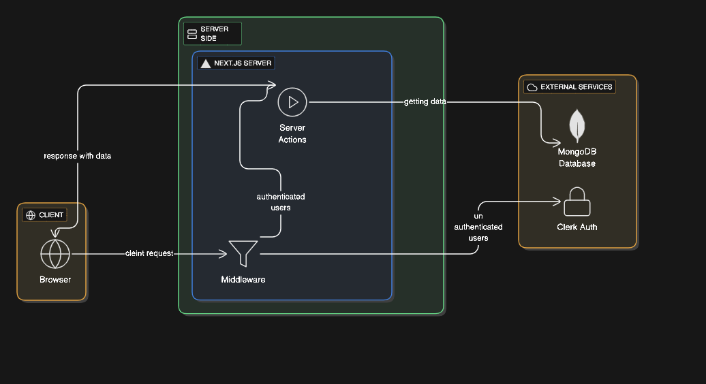

# 🌐 ContactsHub

A modern, full-stack contact and agency management platform built with Next.js 14+, leveraging Server Components, Server Actions, and seamless authentication.

---

## 🛠 Tech Stack

- **Framework**: Next.js 16 (App Router)
- **Authentication**: Clerk
- **Database**: MongoDB
- **Language**: TypeScript
- **Styling**: Tailwind CSS
- **Deployment**: Vercel

---

## 🏗 How It Works



### 1️⃣ Authentication & Middleware (Clerk)

The `middleware.ts` file acts as a gatekeeper. Before any page loads, it checks with Clerk to verify the user's session. If valid, the request proceeds to protected routes like `/agencies` and `/contacts`. If not, users are redirected to `/sign-in`. This happens at the edge—before your app even runs.

### 2️⃣ Hybrid Rendering (Server Components + Client Hydration)

Pages like `app/agencies/page.tsx` are **Server Components** that fetch data directly from MongoDB. They render HTML on the server and send it to the browser instantly. Then, Client Components like `AgencyTable.tsx` "wake up" (hydrate) in the browser to add interactivity—buttons, modals, and state management.

**Result**: Fast initial load + rich interactivity.

### 3️⃣ Server Actions & Data Flow

Instead of traditional API routes, we use **Server Actions** (e.g., `actions/getConetentDetails.ts`). When a user clicks "View Details" in a Client Component, it calls a Server Action that runs securely on the server, queries the database, and returns data—all without exposing database credentials to the client.

### 4️⃣ Database Layer (MongoDB)

The `lib/mongo.ts` file establishes a connection to MongoDB using Mongoose. Server Components and Server Actions use this to query collections like `agencies` and `contacts` directly.

---

## 🚀 Getting Started

### Prerequisites

- Node.js 18+
- MongoDB instance (local or Atlas)
- Clerk account

### Installation
```bash
# Clone the repository
git clone https://github.com/yourusername/contactshub.git
cd contactshub

# Install dependencies
npm install

# Set up environment variables
cp .env.example .env.local
```

### Environment Variables
```env
# Clerk Authentication
NEXT_PUBLIC_CLERK_PUBLISHABLE_KEY=your_clerk_publishable_key
CLERK_SECRET_KEY=your_clerk_secret_key

# MongoDB
MONGODB_URI=your_mongodb_connection_string

# App URL
NEXT_PUBLIC_APP_URL=http://localhost:3000
```

### Run Development Server
```bash
npm run dev
```

Open [http://localhost:3000](http://localhost:3000) in your browser.

---

## 🎯 Key Features

✅ Secure authentication with Clerk  
✅ Direct database queries from Server Components  
✅ Interactive UI with Client Components  
✅ Server Actions for secure data mutations  
✅ TypeScript for type safety  
✅ Optimized hybrid rendering

---

## 📄 License

MIT License - feel free to use this project for learning or production.

---

**Built with ❤️ using Next.js and modern web standards.**